# Crowdfunding Back End
{{ Kate Hoeffler }}

## Planning:
### Concept/Name
{{ The Green Habit - Fundraisers commit a timeframe and green/eco action that is uncomfortable in order to lessen their carbon footprint. Pledges will donate money based on their decision on difficulty/accomplishment. }}

### Intended Audience/User Stories
{{ Intended audience is broad, as anyone can make a change: inclusive to all - students, families, employees, community - groups can sign up.

Utilising the website the fundraiser/fundraisers can sign up as a group or individual and explore example ideas of what they could achieve. The website/profile pages can be shared to encourage pledges to get on board with supporting.

The website includes, updates, ranking, carbon footprint calculator to understand improvements. }}

### Front End Pages/Functionality

Model added in, anything needs to be added into the serializer

- {{ Homepage }}
    - {{ The homepage is the front to get everyone hyped and involved - what are other people doing, and how they are doing. }}
      - {{ Login }}  can sit within the top, login
      <!-- - {{ Join as an individual - join as a group. }} Later considerations -->
      - {{ Join }}   can sit within the top, login
      <!-- - {{ Highlight impact stats }} Later date consideration -->
      - About
      - FAQ's
      - {{ Top fundraisers }} - buy amount fundraised
      <!-- - {{ Group fundraiser ranking and there habit }} Later date consideration -->
      <!-- - {{ Individual fundraiser ranking and there habit }} Later date consideration -->
      - Fundraiser ideas
- {{ Sign Up Page }}
    - {{ Users can register as an individual or group and begin their sustainability journey. }}
      - {{ Individual or group selection }}
      - {{ User details form }}
      - {{ Choose habits from curated categories }}
      - {{ Auto‑generate profile page }}
- {{ Participant Profile Page }}
    - {{ A shareable page showcasing habits, progress, and fundraising goals. }}
      - {{ Fundraise image }}
      - {{ Selected habits }}
      - {{ Weekly progress tracker }}
      - {{ Environmental impact summary }}
      - {{ Fundraising goal and amount raised }}
      - {{ Pledge button }}
      - {{ Supporter messages }}
      - {{ Social sharing options }}
      - DELETE fundraiser
- {{ Pledge / Donation Page }}
    - {{ Supporters can pledge per habit or donate a flat amount. }}
      - {{ Select pledge type }}
      - {{ Simple pledge form }}
      - {{ Optional encouragement message }}
      - {{ Confirmation + share options }}
<!-- - {{ Participant Dashboard }} - LATER CONSIDERATION
    - {{ Central place for participants to track progress and impact. }}
      - {{ Weekly check‑in form }}
      - {{ Visual progress charts }}
      - {{ Carbon footprint calculator }}
      - {{ Notifications and reminders }}
      - {{ Group comparison tools }} -->
<!-- - {{ Carbon Footprint Calculator Page }} - LATER CONSIDERATION
    - {{ Helps users understand the real impact of their habits. }}
      - {{ Simple input fields }}
      - {{ Instant CO₂ savings estimate }}
      - {{ Comparison to averages }}
      - {{ Suggestions for improvement }}
      - {{ Option to add results to profile }} -->
- {{ Login Page }}
    - {{ A simple entry point for returning participants, groups, and supporters to access their accounts and dashboards. }}
      - {{ Email/username and password fields }}
      - {{ Option to log in as an individual or group admin }}
      - {{ “Forgot password” recovery link }}
      - {{ Quick link to create a new account if not yet registered }}
      - {{ Redirect to participant dashboard after login }}
      - {{ Secure authentication to protect user data }}
<!-- - {{ Recover password }}  - Later Consideration
    - {{ In order to recover logins }}
      - {{ Recovery link directed from email }}
      - {{ Login  to new profile }} -->

### API Spec
{{ Fill out the table below to define your endpoints. An example of what this might look like is shown at the bottom of the page. 

It might look messy here in the PDF, but once it's rendered it looks very neat! 

It can be helpful to keep the markdown preview open in VS Code so that you can see what you're typing more easily. }}

| URL | HTTP Method | Purpose | Request Body | Success Response Code | Authentication/Authorisation |
| /fundraisers/ | Get | Gets all the fundraisers from the list | empty | 200 - OK | Any
| /fundraisers/ | Post | Adds a new fundraiser into the list | JSON { title - character (Max count 200), description - text, goal - integer, image - url, fundraiser on or off - boolean data created - date/time, foreign key - connecting to users ID } | 201 - Created | owner/user permission |
| /fundraisers/<int:pk>/ (int:pk being the primary key identifier) | Get | Adds a new fundraiser into the list | empty | 200 - OK | Any |
| /fundraisers/<int:pk>/ (int:pk being the primary key identifier) | Put | Allows the fundraiser/user to see all details and update title/description, image, fundraiser | JSON { title - character (Max count 200), description - text, goal - integer, image - url, fundraiser on or off - boolean data created - date/time, foreign key - connecting to users ID } | - | owner permission |
| /fundraisers/<int:pk>/ (int:pk being the primary key identifier)  | Delete | Allows the fundraiser/user to delete the fundraiser | JSON { title - character (Max count 200), description - text, goal - integer, image - url, fundraiser on or off – Boolean, data created - date/time, foreign key - connecting to users ID } – however, you just need to add in the lines you want to update | 204 – No Content | owner/user permission |
| /pledges/ | Get | Gets all the pledges from the list | empty | 200 - OK | Any
| / pledges / | Post | Adds a new pledge to a specific fundraiser | JSON {"amount": integer, "comment": "Text", "anonymous": boolean, "fundraiser": User PK} | 201 - Created | owner/user permission |
| /users/ | Get | Gets all the fundraisers from the list | empty | 200 - OK | Any
| / users / | Post | Adds a new user into the list | JSON {"username": "text", "password": "text", "email": "text"} | 201 - Created | any|
| / users /<int:pk>/ | Get | Gets the details of a specific user ID | empty | 200 - OK | Any |
| / users /<int:pk>/ (int:pk being the primary key identifier) | Delete | Allows the user to delete their account JSON {"username": "text", "password": "text", "email": "text"} | 204 – No Content | owner/user permission |

### DB Schema

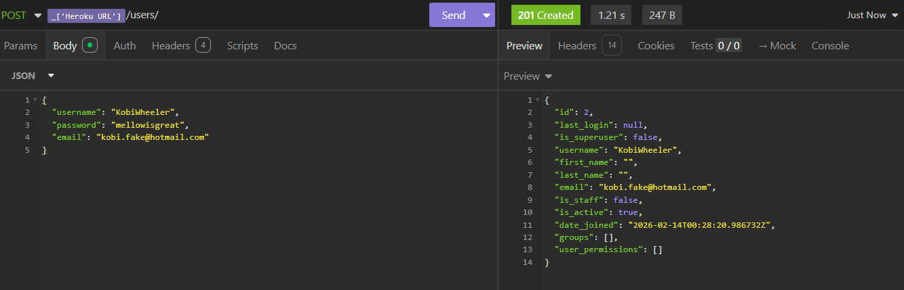
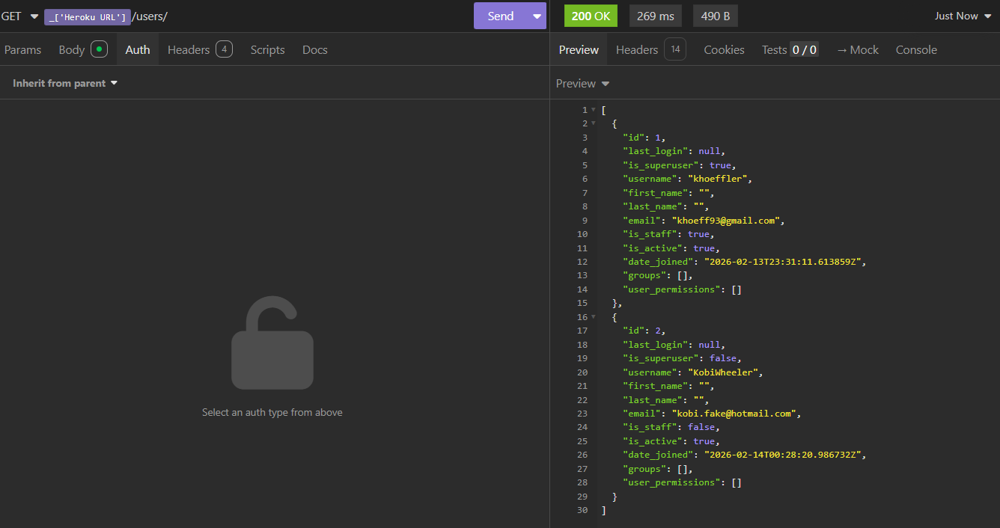
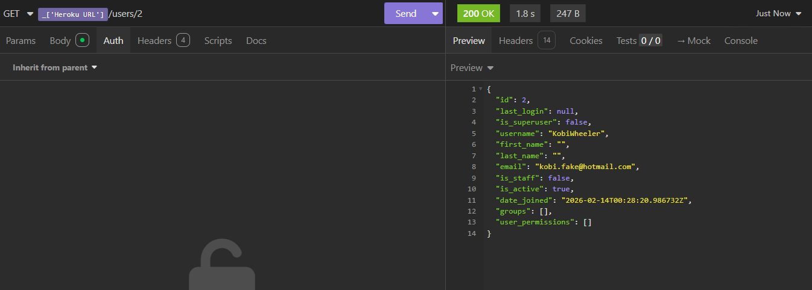
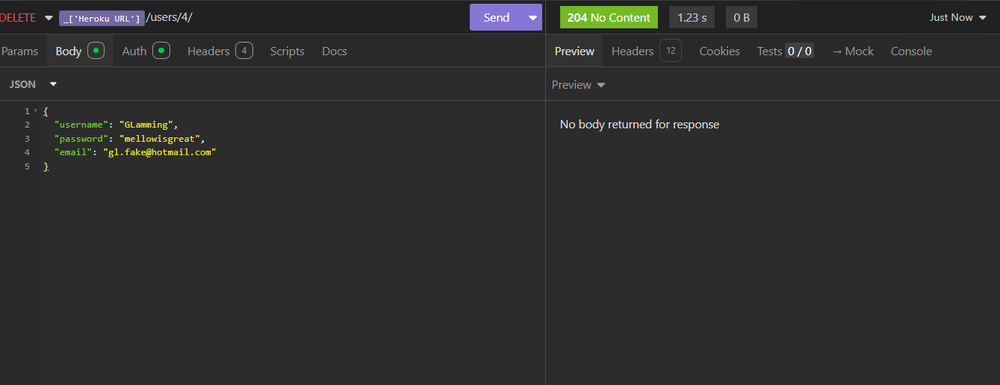
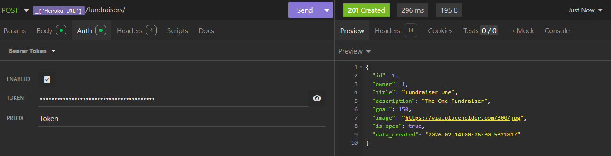
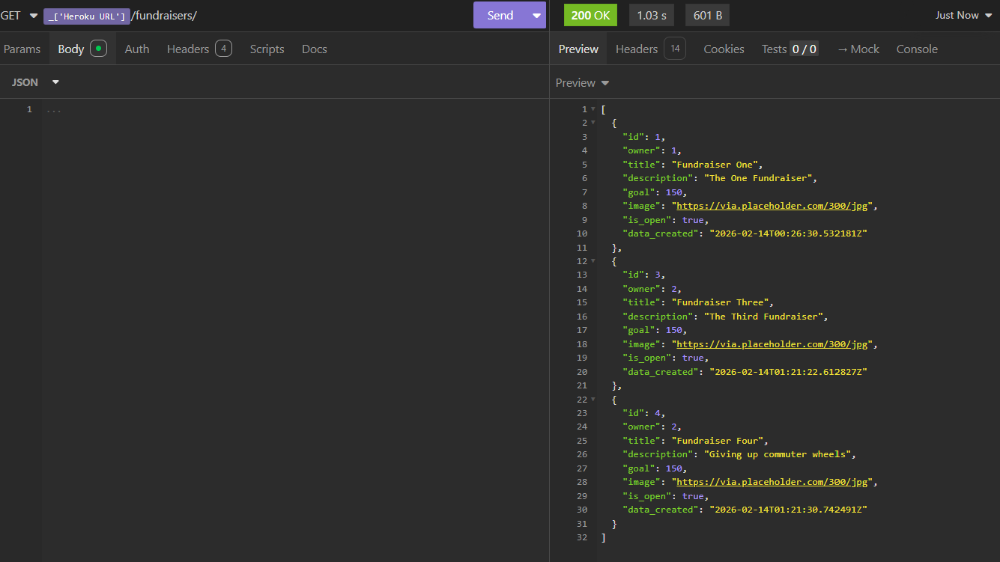
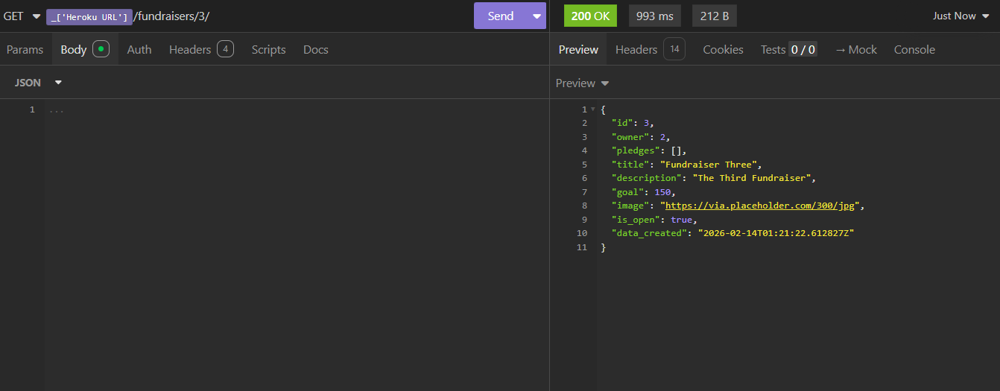
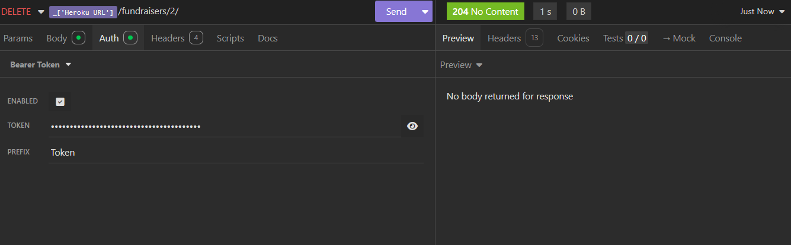
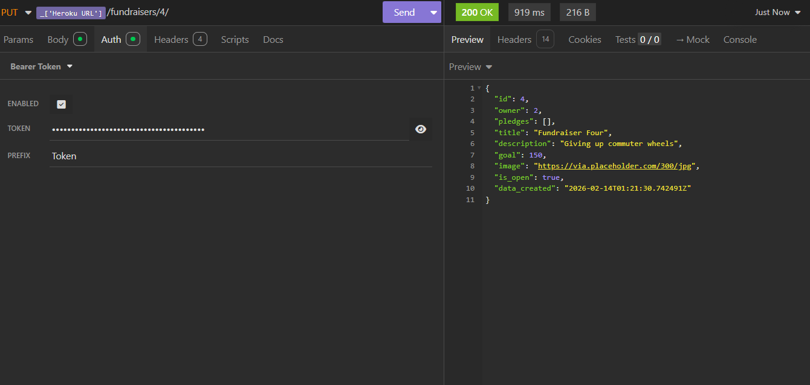
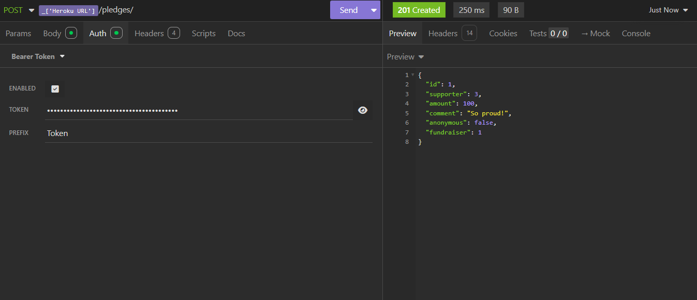
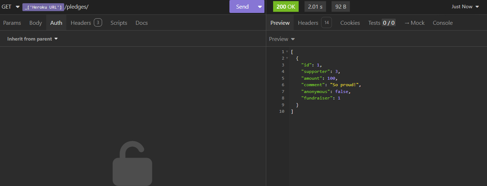
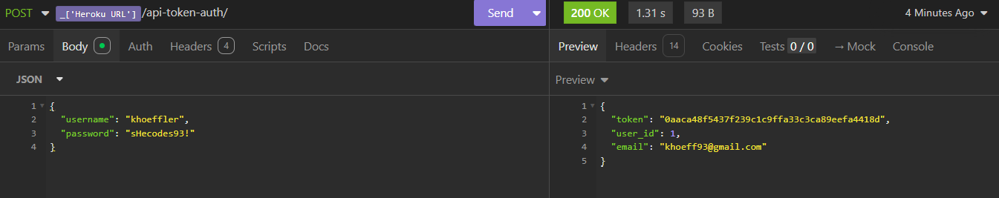

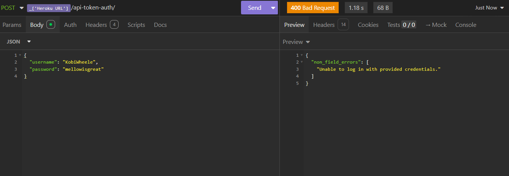
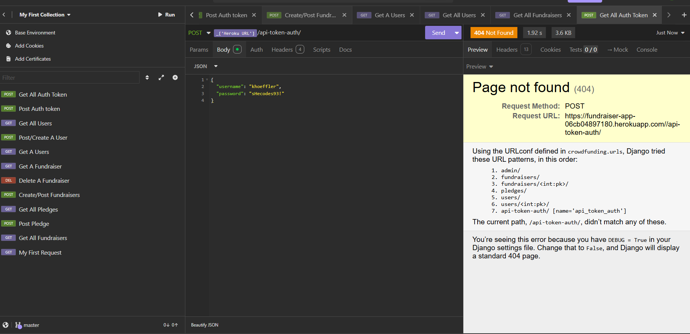
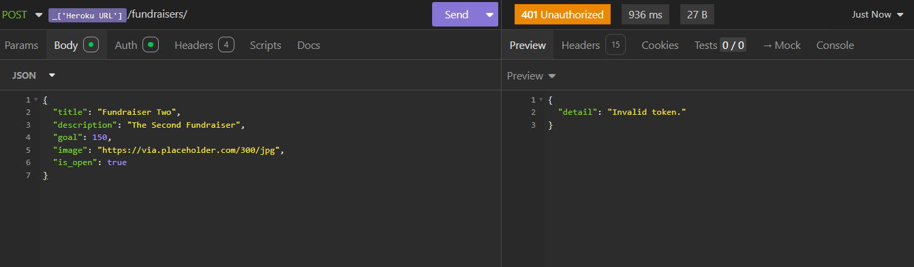

